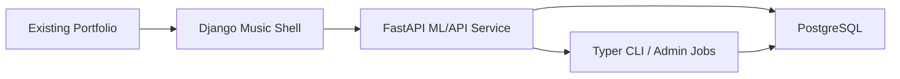

# Indian Music Intelligence Platform v2.0 Technical Report

Author: Sampath Naga Maddineni

## Abstract

Indian Music Intelligence Platform v2.0 extends the original music analysis and recommendation notebook into a full-stack machine learning and backend engineering project. The system preserves v1.0 as an archived academic baseline and introduces a PostgreSQL-backed data platform, FastAPI service layer, Django portfolio shell, owner/admin data operations, automatic Indian music labeling, dashboard analytics, and explainable hybrid recommendations.

## Problem Statement

Music recommendation projects often stop at notebook similarity scores. This project reframes the work as a production-style platform problem: collect and normalize music metadata, preserve source lineage, infer useful Indian music labels, expose public analytics, provide protected owner workflows, evaluate recommendations, and present the result through an existing professional portfolio.

The v2 goal is optimized for ML/data and Python backend roles by showing:

- data modeling and lineage
- API design
- data quality operations
- recommender methodology
- admin workflows
- deployment readiness
- portfolio integration

## v1.0 Baseline

The v1.0 project is preserved under `archive/v1.0/`. It includes the original notebook, report, presentation, and recommender helper. That version focused on exploratory analysis, PySpark workflows, regression, PCA similarity, and clustering.

v2.0 keeps the original work as evidence of the starting point, then turns the idea into a maintainable product-style system.

## Architecture

The platform uses a two-service architecture plus PostgreSQL:

- Django music shell for portfolio-friendly pages, navigation, and React-style JavaScript islands.
- FastAPI service for public read APIs, recommender APIs, protected admin APIs, and ML/data jobs.
- PostgreSQL for normalized entities, source lineage, labels, quality checks, jobs, model runs, and recommendation results.

Local development runs through Docker Compose. Production deployment is prepared with Docker start scripts and a Render blueprint.

## Data Pipeline

The current import pipeline supports:

- CSV track imports
- generic JSON track imports
- public playlist-style JSON imports
- Spotify playlist collection when API credentials are available

Every import creates or updates normalized tracks, artists, playlists, playlist-track links, raw snapshots, and track-source lineage records. Large raw data, generated artifacts, model files, and vector indexes are intentionally kept out of Git.

## Database Design

Core tables include:

- `tracks`
- `artists`
- `playlists`
- `track_artists`
- `playlist_tracks`
- `collection_sources`
- `raw_snapshots`
- `track_sources`
- `inferred_labels`
- `label_overrides`
- `job_runs`
- `job_events`
- `model_runs`
- `recommendation_runs`
- `recommendation_results`
- `data_quality_checks`
- `data_quality_results`

The key design choice is separation between raw source evidence, normalized application entities, inferred labels, and owner/admin overrides.

## Automatic Labeling

The first v2 labeling layer is rules-based and deterministic. It infers:

- language
- music type
- mood
- region

Signals include track names, album names, artist names, playlist names, source category, and import source text. Every label stores confidence and evidence.

Owner overrides are stored in `label_overrides` without deleting inferred labels. Public detail APIs show both inferred and effective labels, while recommender scoring uses effective labels.

## Recommendation Methodology

The current recommender is a hybrid metadata scorer designed for explainability and reliable portfolio demonstration. It combines:

- language overlap
- mood overlap
- music type overlap
- region overlap
- release-era proximity
- official popularity proximity when available
- TF-IDF text similarity from normalized track, artist, playlist, and label text
- diversity penalty
- owner/admin label overrides

The TF-IDF builder stores feature text in PostgreSQL and writes an ignored local vector artifact under `artifacts/recommender/`. Recommendation scoring uses that artifact when available and falls back to metadata scoring when it is missing. Each result includes human-readable reasons and a technical score breakdown.

## Evaluation

The first model evaluation job stores `model_runs`, `recommendation_runs`, and `recommendation_results`. It measures:

- seed count
- result count
- recommendation coverage
- unique recommended tracks
- average results per seed
- seed-exclusion pass rate
- average score

On the local sample dataset, the evaluation path verifies that the recommender excludes the seed track and produces saved model metrics for the Model Insights page.

## Dashboard and Application Pages

The local demo includes:

- dashboard KPIs
- language mix
- mood/type distribution
- popularity spread
- recommender coverage
- language trends
- top playlist sources
- data quality summary
- song explorer
- song detail with source playlists and effective labels
- artist explorer
- artist detail
- artist network
- recommender UI
- model insights
- admin operations console

## Admin/Data Ops

Admin Ops supports:

- sample CSV import
- public playlist JSON import through CLI/API
- Spotify credential-dependent collection
- quality checks
- recommender evaluation
- job history
- job detail with event payloads
- model run history
- label override persistence

Admin endpoints require `x-admin-token` in the current milestone and are designed to evolve toward portfolio session or signed-token integration.

## Deployment

Deployment readiness includes:

- production Docker entrypoints
- API health endpoint
- Django shell health endpoint
- environment-driven CORS
- Gunicorn for Django shell
- Render blueprint
- managed PostgreSQL target
- sample import smoke-check commands

The preferred long-term deployment is portfolio subpath routing. The current low-friction fallback is a separately deployed music shell linked from the portfolio project card.

## Limitations

Current limitations:

- live Spotify collection requires developer credentials
- sample dataset is intentionally small
- recommender uses a local TF-IDF vector artifact, but not yet sentence embeddings or pgvector
- no public user accounts or personalization
- no audio playback
- no paid LLM query parser

## Future Work

Planned improvements:

- larger Indian music dataset collection
- richer Spotify/public playlist seeds
- sentence-transformer features
- pgvector similarity when hosting supports it
- playlist holdout evaluation at larger scale
- popularity prediction as a secondary ML demo
- stronger artist collaboration graph
- deployed production instance
- refreshed PDF report and PPT exports from these Markdown sources

## Current Local Demo

Local URLs:

- Portfolio: `http://127.0.0.1:8000/`
- Music dashboard: `http://127.0.0.1:8010/music/`
- Admin Ops: `http://127.0.0.1:8010/admin/`
- API docs: `http://127.0.0.1:8001/docs`
